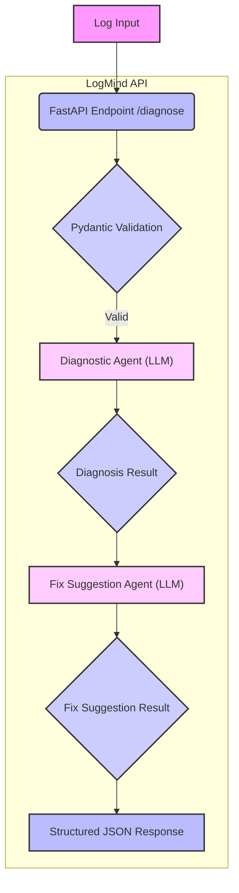

# LogMind API

Automated log diagnostic API for Airflow using multi-agent LLM architecture.

## What It Does

Analyzes Airflow logs and provides structured diagnostics with actionable fix suggestions. It uses two specialized LLM agents working in sequence: one identifies the problem, the other suggests how to fix it.

## Current Features

*   Two-agent architecture (diagnostic + fix suggestion)
*   OpenAI GPT-4o-mini integration
*   Structured JSON responses with confidence scoring
*   Input validation with Pydantic
*   Docker containerization
*   Automatic API documentation

## Architecture

The LogMind API architecture is designed to process logs efficiently and intelligently, using a multi-agent approach. The data flow and interaction between components are illustrated in the diagram below:



This separation ensures each agent is focused and optimized for its specific task:

*   **Agent 1** analyzes the log and categorizes the error.
*   **Agent 2** receives the diagnosis and suggests actionable fixes.

## Quick Start

### With Docker

```bash
# Setup
cp .env.example .env
# Add your OPENAI_API_KEY to .env

# Run
docker-compose up -d

# Test
curl http://localhost:8000/docs
```

### Without Docker

```bash
# Install
python3 -m venv venv
source venv/bin/activate
pip install -r requirements.txt

# Configure
cp .env.example .env
# Add your OPENAI_API_KEY to .env

# Run
uvicorn main:app --reload
```

## Example Usage

**Request:**

```bash
curl -X POST http://localhost:8000/diagnose \
  -H "Content-Type: application/json" \
  -d '{
    "log_content": "[2025-01-20] ERROR: Connection to PostgreSQL refused",
    "source": "airflow"
  }'
```

**Response:**

```json
{
  "status": "success",
  "error_type": "ConnectionError",
  "summary": "PostgreSQL connection refused - server may be down",
  "confidence": 0.95,
  "affected_components": ["PostgreSQL", "Airflow Task"],
  "suggested_fix": "Check if PostgreSQL is running. Verify network connectivity and firewall settings for port 5432."
}
```

## Project Structure

```
logmind-api/
├── app/
│   ├── agents/          # LLM agents (diagnostic, fix suggestion)
│   ├── core/            # Configuration
│   └── schemas/         # Request/response models
├── main.py              # FastAPI app
├── Dockerfile
├── docker-compose.yml
└── requirements.txt
```

## Technical Stack

*   **Framework:** FastAPI
*   **Validation:** Pydantic
*   **LLM:** OpenAI GPT-4o-mini
*   **Deployment:** Docker + Docker Compose
*   **Python:** 3.12+

## Key Design Choices

*   **Why multi-agent?** Separating diagnosis and solution into different agents improves accuracy. Each can be optimized independently with targeted prompts.
*   **Why sequential processing?** The fix agent needs the diagnostic results as context. This ensures suggestions are relevant to the specific error identified, not generic troubleshooting.
*   **Why structured outputs?** Using JSON response format eliminates parsing errors and enables type-safe integration with other systems.

## Performance

*   Response time: 4-6 seconds (two sequential LLM calls)
*   Cost per request: ~$0.0002 (GPT-4o-mini pricing)

## Future Improvements

*   Caching for common error patterns
*   Batch processing endpoint
*   Historical error database
*   Pattern recognition across logs

## License

MIT
